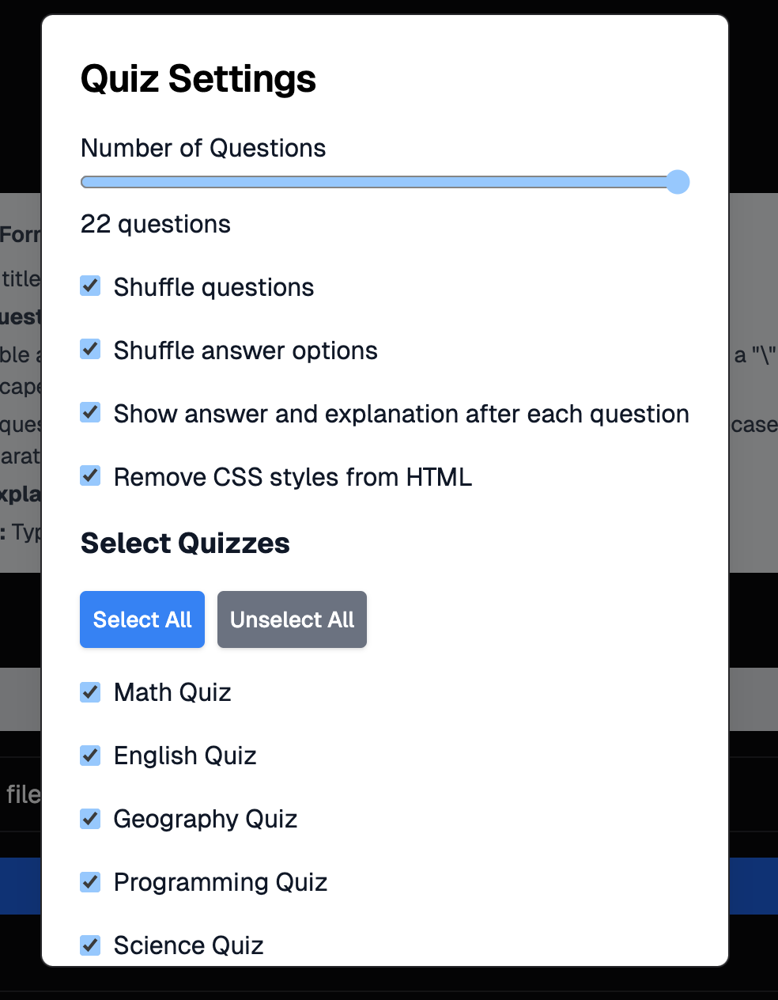
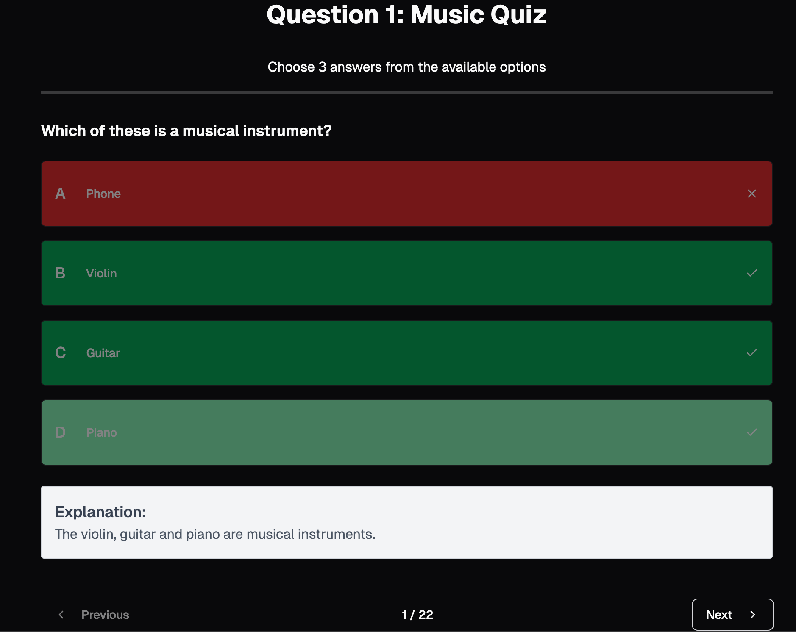

# Quiz Generator by Importing CSV


The Quiz Generator allows you to randomly create quizzes by importing a CSV file containing a question bank. The CSV must have the following header row:

- **Quiz Title**
- **HTML of the Question**
- **Answer**
- **Options**
- **HTML of the Explanation to the Answer**
- **Question Type**

### Question Types

The _Question Type_ can be one of the following:

- **mc**: Choose the correct answers from the available choices. The answer should be single upper-case alphabet characters, and if more than one answer is correct, separate them with a `|`. The number of options should not exceed 26.

For the HTML of the questions or the explanation, you may simply fill in with the text or with HTML elements, such as `<table>`, ``, etc. Ensure that your images can be found online.

If any of the columns are incorrect in the question row, the quiz will omit the question.

### How to Use

1. **Download the Template CSV (Optional)**  
   If you're starting from scratch or don't have a CSV file ready, you can download the template CSV with basic Maths and English questions by clicking on the _Download Template_ button.

2. **Upload a CSV File**

   - Upload your own CSV file containing questions.
   - Ensure the file adheres to the required CSV format: Quiz Title, Question HTML, Answer, Options, Explanation, and Question Type.

3. **Analyse the CSV**

   - After uploading the CSV, click the _Analyse_ button to validate and extract questions.
   - A list of quiz titles from the CSV will be displayed. Select the quiz titles you want to include in the quiz by checking the box next to each title.
   - The questions under the selected quiz titles will be shown.



4. **Adjust Settings (Optional)**

   - You can customise the number of questions to include in the quiz using a range slider.
   - Choose whether to shuffle the questions and the answer options.
   - Toggle whether to show the answer and explanation after each question.
   - Choose whether to remove all className-related unwanted CSS styles inside the HTML code.
   - Filter questions by quiz titles.

5. **Generate Quiz**  
   Once you're happy with your settings, click on the _Apply & Start Quiz_ button to generate your quiz.

6. **Take the Quiz**  
   You will be redirected to the quiz interface where you can answer the questions and view explanations if enabled.



7. **View the Result**


### Example CSV Format

Here's an example of what your CSV file should look like, including multiple correct answers and inline CSS styles:

| Quiz Title   | HTML of the Question                                                                | Answer | Options                                                                        | HTML of the Explanation                                                                                                                                                                                                                                      | Question Type |
| ------------ | ----------------------------------------------------------------------------------- | ------ | ------------------------------------------------------------------------------ | ------------------------------------------------------------------------------------------------------------------------------------------------------------------------------------------------------------------------------------------------------------ | ------------- |
| Maths Quiz   | `<p style="color: blue;">What is 2 + 2?</p>`                                        | B      | 3 \| 4 \| 5 \| 6                                                               | `<p style="font-size: 14px; color: green;">The correct answer is 4 because 2 + 2 equals 4.</p>`                                                                                                                                                              | mc            |
| Science Quiz | `<p style="font-weight: bold;">What is the boiling point of water?</p>`             | B      | 100 \| 90 \| 120 \| 80                                                         | `<p>The boiling point of water is 100°C at standard atmospheric pressure.</p>`                                                                                                                                                                               | mc            |
| History Quiz | `<p style="font-size: 18px;">Who were the prime ministers during World War II?</p>` | A \| C | Winston Churchill \| Neville Chamberlain \| Clement Attlee \| Harold Macmillan | `<p style="font-size: 16px;">Winston Churchill (A) was the prime minister during most of World War II, and Neville Chamberlain (B) served before him. Clement Attlee (C) became prime minister after the war and played a key role in post-war Britain.</p>` | mc            |

## Handling Escaped `|` in Options

If there is a "|" inside an option, add a "\" before the character to escape it. This code correctly splits options by `|` while handling escaped `|` (`\|` properly).

### Try Our Template

- You can try a basic Maths, JavaScript, and English quiz template for quick testing.

## How to Run

1. Install dependencies:
   ```
   npm install
   npm install motion
   ```
2. Start the application
   ```
   npm start
   ```

## Sample Python Code to Generate CSV

This Python script automates the process of logging into a system and extracting quiz questions to generate a CSV file. It uses `pyppeteer`, a Python library to control a headless browser (Chromium) to automate web actions like logging in, selecting modules, and extracting questions.

### Prerequisites

You will need to install the required dependencies for the script to run:

1. **Install `pyppeteer` and other dependencies**:

   ```bash
   pip install pyppeteer
   ```

2. Dependencies:
   - `pyppeteer` for browser automation.
   - csv (standard Python library) for writing the extracted questions to a CSV file.

### Customizing the Script

In the code, you can customize the following variables for your needs:

```
email = "myemail@gmail.com" # Your login email
password = "mypassword" # Your login password
url = "http://example.com" # The URL of the system you're logging into
module = "mymodule" # The module name you want to select
email: Enter your email address here.
password: Enter your password here.
url: Replace the URL with the login page URL of the system you need to access.
module: Set the module name you wish to extract questions from.
```

### How to Use

1. Run the Script:

   - Ensure that you have Python 3.x installed and the required dependencies (pyppeteer) installed as mentioned above.
   - Run the script:

```
python generateQuestions.py
```

The script will:

1.  Open a Chromium browser.
2.  Navigate to the login URL.
3.  Input the email and password to log in.
4.  Accept cookies if prompted.
5.  Select the specified module.
6.  Extract all quiz questions and options.
7.  Write the extracted data to a questionBank.csv file.
8.  Check the Output:

    - After running the script, check the questionBank.csv file. It will contain the following columns:
      - Quiz title: The title of the quiz.
      - HTML of the question: The complete HTML content of each question.
      - Answer: The correct single upper-case alphabet answer for the question.
      - Options: A list of answer options, separated by |.
      - HTML of the explanation: The full HTML content for the explanation of the answer.
      - Question type: In this case, "mc" for multiple-choice questions.

### Notes

- The script runs in a non-headless mode by default (headless=False), meaning it will open the browser window for debugging. If you want it to run in the background without opening a browser window, change headless=False to headless=True in the code.
- Ensure the correct module name is used for selection in the system (this is defined by the module variable).
